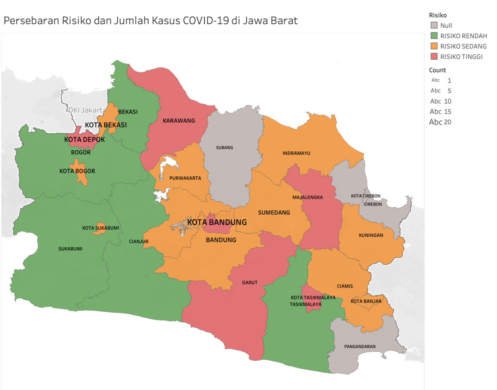

# Visualisasi Peta Zona Risiko COVID-19 dan Sebaran Kasus di Jawa Barat

Repository ini berisi hasil analisis dan visualisasi data yang menggabungkan peta zona risiko COVID-19 dengan titik sebaran kasus COVID-19 di Jawa Barat. Data yang digunakan berasal dari Satuan Tugas Penanganan COVID-19 dan API publik yang disediakan oleh Digital Service Indonesia.

## Sumber Data
1. **Peta Zona Risiko COVID-19**: Data mingguan zona risiko yang dirilis oleh Satuan Tugas Penanganan COVID-19.
2. **Sebaran Kasus COVID-19**: Data sebaran kasus COVID-19 di Jawa Barat diambil dari API publik: [https://covid19-public.digitalservice.id/api/v1/sebaran_v2/jabar](https://covid19-public.digitalservice.id/api/v1/sebaran_v2/jabar).
3. **Peta Wilayah Jawa Barat**: Data geografis Jawa Barat diambil dari Open Data Jawa Barat.

## Tujuan
Tujuan dari proyek ini adalah untuk membuat visualisasi yang menggabungkan:
- Peta zona risiko COVID-19 (berdasarkan warna zona: merah, oranye, kuning, hijau).
- Titik sebaran kasus COVID-19 di Jawa Barat.

Visualisasi ini diharapkan dapat memberikan gambaran yang lebih jelas mengenai persebaran kasus COVID-19 dan tingkat risiko di setiap wilayah di Jawa Barat.

## Langkah-Langkah Analisis
1. **Pengambilan Data**:
   - Mengunduh data zona risiko COVID-19 dari sumber resmi.
   - Mengambil data sebaran kasus COVID-19 melalui API.
   - Mengunduh peta wilayah Jawa Barat dari Open Data Jawa Barat.

2. **Pengolahan Data**:
   - Membersihkan dan memproses data zona risiko.
   - Menggabungkan data zona risiko dengan data sebaran kasus.
   - Menyiapkan data geografis untuk visualisasi.

3. **Visualisasi**:
   - Membuat peta interaktif menggunakan library seperti `folium` atau `plotly` di Python.
   - Menampilkan zona risiko dengan warna yang sesuai (merah, oranye, kuning, hijau).
   - Menambahkan titik sebaran kasus COVID-19 di atas peta.

4. **Interpretasi**:
   - Memberikan interpretasi singkat mengenai hasil visualisasi.
   - Menyimpulkan wilayah dengan risiko tertinggi dan persebaran kasus yang perlu diperhatikan.

## Hasil Visualisasi
Berikut adalah contoh visualisasi yang dihasilkan:

## Interpretasi
- Wilayah dengan zona merah menunjukkan tingkat risiko yang sangat tinggi, diikuti oleh oranye, kuning, dan hijau.
- Titik sebaran kasus COVID-19 menunjukkan konsentrasi kasus di wilayah tertentu.
- Dari visualisasi, dapat dilihat bahwa beberapa wilayah dengan zona merah memiliki jumlah kasus yang tinggi, sementara wilayah dengan zona hijau relatif aman.
